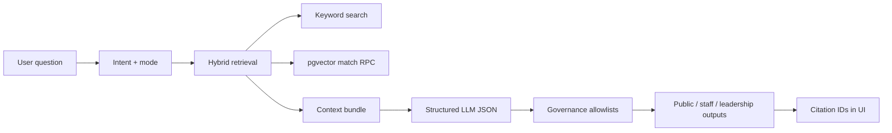
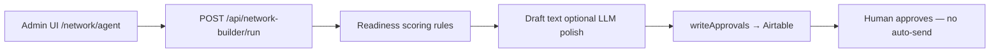

# Applied AI Engineer — Infra24 evidence pack

> **Build state: `shipping`** — code on the Applied AI Stage-0 branch. Treat claims as **pilot** until migration + embedding sync + live eval are verified on the production host.  
> **Career pages (CV, opportunity dossiers):** [moises.tech/career-packet](https://www.moises.tech/career-packet)  
> **Strict verifier:** Do not claim “verified-live pgvector RAG” or a green eval scoreboard until `docs/career-evidence/REPO_TRUTH_AUDIT.md` says so.  
> **Last updated:** 2026-08-10

---

## Executive summary

Infra24 is a **multi-tenant cultural infrastructure platform** (Next.js, Supabase, Airtable) with two applied-AI surfaces you can demo:

| Surface | What it proves | Live URL (DCC pilot) |
|---------|----------------|----------------------|
| **Memory Agent** | Governed hybrid retrieval, citations, staff/public modes, eval harness | `/memory-agent` → `/o/dcc/memory-agent` |
| **Network Readiness Agent** | Agentic CRM proposals, human-in-the-loop Airtable approvals | `/network/agent` (gated) |

**pgvector** migration + sync code ships with this pack but is **partial** until applied and measured live. This is **pilot-grade** engineering with production *patterns* (eval harness, governance, deployment checklist) — not enterprise-scale multi-region production.

---

## Architecture (Memory Agent)



**Hand-rolled pipeline** — not LangChain/LangGraph. Intentional for this pilot; framework depth is a documented gap.

### Key files

| Layer | Path |
|-------|------|
| Ask orchestration | `lib/memory-agent/ask.ts` |
| Hybrid retrieval | `lib/memory-agent/retrieve.ts`, `lib/memory-agent/vector-retrieve.ts` |
| Embeddings sync | `lib/memory-agent/embedding-sync.ts`, `scripts/tools/sync-memory-agent-embeddings.ts` |
| pgvector schema | `supabase/migrations/20260711120000_memory_agent_embeddings_pgvector.sql` |
| Golden eval | `__tests__/fixtures/memory-agent-golden.json`, `scripts/tools/eval-memory-agent.ts` |
| Staff citation UI | `components/memory-agent/MemoryAgentContextInspector.tsx` |
| Governance | `lib/memory-agent/governance.ts`, `docs/memory-agent/AI_PUBLIC_OUTPUT_GOVERNANCE.md` |

---

## Architecture (Network Readiness Agent)



| Layer | Path |
|-------|------|
| Run loop | `lib/network-builder/run-network-readiness.ts` |
| Scoring | `lib/network-builder/readiness.ts` |
| Airtable write | `lib/network-builder/write-approvals.ts` |
| Optional polish | `lib/network-builder/personalize-draft.ts` (`NETWORK_BUILDER_LLM_POLISH=true`) |
| UI | `components/marketing/dcc-network/NetworkAgentPageClient.tsx` |
| Setup doc | `docs/network-builder/DCC_AGENT_APPROVALS_AIRTABLE_SETUP.md` |

---

## Demo playbook

| Audience | Doc | Duration |
|----------|-----|----------|
| Interview (technical) | `docs/DCC_UNIFIED_DEMO_SCRIPT.md` § Interview | ~8 min |
| DCC partner | Same doc § Partner | ~12 min |
| Env + URLs | `docs/VERCEL_DEMO_ENV_CHECKLIST.md` | — |
| Recruiter landing | `/applied-ai` on deployed site | 2 min read |

### Pre-demo commands

```bash
npm run sync:memory-agent-embeddings -- --org=dcc
npm run eval:memory-agent -- --org=dcc --report=reports/memory-agent-eval.json
npm run network-builder:schema-gap -- --org=dcc
```

---

## Honest requirement matrix (Tier 2 applied AI roles)

| Requirement | Status | Infra24 evidence |
|-------------|--------|------------------|
| RAG | **Strong (institutional pilot)** | Memory Agent hybrid retrieve→generate + citations |
| Vector DB | **Strong** | Supabase pgvector + HNSW + sync job |
| Agent orchestration | **Partial** | Hand-rolled pipeline + separate Network Agent; not LangGraph |
| Production deployment | **Partial** | Vercel pilot; governance docs; eval CI optional |
| LLM eval | **Partial** | Golden fixture + grounding assertions |
| Tool use / actions | **Partial** | Airtable approval writes; no Gmail send in MVP |
| n8n / Make automation | **External** | Documented on moises.tech — not in this repo |
| Bedrock / Vertex / Foundry | **Gap** | OpenAI direct only |
| Python AI/ML depth | **Gap** | TypeScript-first in this codebase |

Full gap build plan: `docs/APPLIED_AI_GAP_MAP.md`.

---

## What to say in interviews

**Lead with:** “I built a governed institutional RAG pilot with pgvector, citation allowlists, and a golden eval suite, plus a separate approval-gated agent that proposes CRM actions without auto-send.”

**If asked LangChain:** “This pilot uses a hand-rolled pipeline so we could control governance and eval. I’m building LangGraph parity in a separate public Career Pipeline RAG repo for framework depth.”

**If asked production scale:** “Pilot on Vercel with eval gates and human approval queues — patterns ready for production hardening, not claiming millions of users.”

**If asked n8n:** “Production Gmail label routing + Airtable sync — see moises.tech career packet; ops automations live outside Infra24.”

---

## Artifacts to capture before applying

- [ ] 90s screen recording: voice ask → citation panel → Airtable approval row
- [ ] `reports/memory-agent-eval.json` with passing run
- [ ] Staging URL with `DCC_NETWORK_ADMIN_ENABLED=true`
- [ ] Export updated résumé PDF on moises.tech referencing this demo

---

## Related docs

- `docs/APPLIED_AI_GAP_MAP.md` — what to build next
- `docs/MEMORY_AGENT_ROADMAP.md` — product roadmap
- `docs/AI24_SIX_WEEK_SPEC_POINTER.md` — sibling AI24 workstream (spec only)
- `website/ai24/docs/AI24_SIX_WEEK_DEMO_ELEVATION_SPEC.md` — AI24 elevation (separate repo path)

---

## Moises — inputs still needed

See **Section “Open questions”** in `docs/APPLIED_AI_GAP_MAP.md`.
