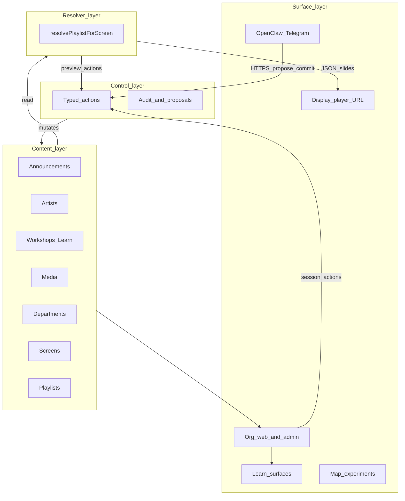

# Infra24 master strategy memo

**Product and technical alignment** — for grants, pilots, advisors, and model-assisted planning.  
Technical claims in the “exists today” and “gap map” sections are anchored to paths in this repository unless noted as roadmap.

---

## 1. Frozen product thesis

> **Infra24 is a multi-tenant cultural infrastructure platform where institutions publish and control announcements, artists, workshops, learning content, and public displays through a shared substrate: a resolver-backed display plane, governed web admin, and a typed control API designed for conversational operators (e.g. OpenClaw + Telegram) that never bypass validation or audit.**

**Discipline:**

- **Web admin** = deep editing and configuration (Clerk session).
- **Conversational control** = fast operational lane: natural language stays *outside* the Next.js app; the app accepts **structured JSON actions** only.
- **Same spine** for both lanes: typed mutations, optional **propose → commit** for agents, **execute-immediate** for trusted browser sessions only.

---

## 2. Strategic wedge (vs generic signage)

**Do not compete** with commodity digital signage vendors (e.g. Displays2Go) on template libraries, generic enterprise kiosk bundles, or indoor-nav SKU breadth alone.

**Do compete** on a narrower, defensible wedge:

**Department-aware conversational cultural infrastructure** — systems that understand programs, residencies, labs, artist visibility, workshop/learn surfaces, and public communication *as one institution*, with **governance** (roles, audit, two-phase commits for agents).

**Compressed contrast:**

| Generic signage | Infra24 wedge |
|-----------------|---------------|
| Screen schedules and templates | Institution-native content (departments, artists, workshops, learn) |
| Central CMS | Resolver + typed actions as single coherence layer |
| Dashboard-only ops | Web deep lane + chat fast lane on the **same** action API |

---

## 3. Core moat: resolver + typed action layer

The **product spine** is not any single UI. It is:

1. **Resolver** — Given org + screen + time, produces the ordered **slides** a display should show (with rules for visibility, schedule, department filters).
2. **Typed action layer** — The only supported way to mutate display/control state for automation: validated payloads, org membership + role checks, audit records, propose/commit for risky mutations from service tokens.

**Implementation anchors (this repo):**

| Concern | Location |
|---------|----------|
| Resolver | [`lib/display-plane/resolver.ts`](../lib/display-plane/resolver.ts) |
| Slide / item kinds (enums) | [`lib/domain/display.ts`](../lib/domain/display.ts) |
| Control orchestration | [`lib/control-plane/execute.ts`](../lib/control-plane/execute.ts), [`lib/control-plane/immediate.ts`](../lib/control-plane/immediate.ts) |
| Audit + proposals | [`lib/control-plane/audit.ts`](../lib/control-plane/audit.ts), [`lib/control-plane/proposals.ts`](../lib/control-plane/proposals.ts) |
| Service/session auth | [`lib/control-plane/auth.ts`](../lib/control-plane/auth.ts) |
| Display APIs | `GET /api/display/v1/screens/[screenId]/playlist`, `GET /api/display/v1/org/[slug]/screens/[screenKey]/playlist` |
| Control APIs | `POST /api/control/v1/propose`, `POST /api/control/v1/commit`, `POST /api/control/v1/execute-immediate` |
| DB migration (screens, playlists, control) | [`supabase/migrations/20250331000001_display_control_plane.sql`](../supabase/migrations/20250331000001_display_control_plane.sql) |
| Kiosk-style player | [`app/display/[orgSlug]/[screenKey]/page.tsx`](../app/display/[orgSlug]/[screenKey]/page.tsx) |
| Web admin (screens/playlists) | [`app/o/[slug]/admin/screens/page.tsx`](../app/o/[slug]/admin/screens/page.tsx), [`components/display-admin/DisplayScreensAdmin.tsx`](../components/display-admin/DisplayScreensAdmin.tsx) |
| Operator docs | [`docs/openclaw-control-plane.md`](./openclaw-control-plane.md) |
| Action enum / examples | [`docs/control-actions.schema.json`](./control-actions.schema.json) |

Surfaces (LMS pages, org marketing routes, map pages, Telegram) should consume or trigger this spine — not duplicate ad hoc “what’s on screen” logic.

---

## 4. Four-layer architecture

---

## 5. What exists today (honest inventory)

**Multi-tenant orgs and auth**

- Organizations, Clerk, `org_memberships`, per-org routes under `/o/[slug]/…`, theme JSONB, tenant navigation configs.

**Operations and community**

- Bookings, resources, group bookings, surveys, submissions, donations/waitlist patterns (as implemented in `app/api` and related libs).
- Artists: `artist_profiles`, directories, claiming flows.

**Communications and programming**

- Announcements: rich types, org and public APIs, carousels, org announcement UIs.
- Workshops: DB-backed workshops, sessions, registrations, analytics APIs; learn paths under `app/learn` and `features/learn-canvas`; filesystem MD content under `content/workshops/`.
- Courses: parallel course/lesson/enrollment APIs and org course pages.
- Events: lighter-weight event pages and materials/feedback APIs (workshops carry much of “programming” load).

**Media**

- Upload API and `media_files` storage pattern.

**Maps / wayfinding**

- Interactive map components and tenant-specific map pages; not yet a generalized indoor-navigation product.

**Display + control substrate (implemented)**

- Tables: `departments`, `screens`, `playlists`, `playlist_items`, `screen_assignments`, `control_proposals`, `control_action_logs`, `control_identities`; `announcements.department_id` FK (see migration above).
- Resolver-driven playlist JSON for players; optional per-screen `display_token` in `screens.settings`.
- Admin overview API: `GET /api/display-admin/[slug]/overview` (session + elevated roles).

**Documentation for external agents**

- OpenClaw-oriented HTTP contract and curl examples in [`docs/openclaw-control-plane.md`](./openclaw-control-plane.md).

---

## 6. Gap map (alignment table)

### 6.1 Typed control actions (current)

Defined in [`lib/control-plane/execute.ts`](../lib/control-plane/execute.ts).

**Read-only** (single `propose` response; `proposal_id` null):

| Action | Purpose |
|--------|---------|
| `display.resolver_preview` | Preview resolved slides for a `screen_id` (bypasses display token) |
| `display.screens_overview` | Per-screen summary: active playlist, slide count, first slide title |
| `departments.list` | List departments for org |
| `screen.list` | List screens for org |
| `playlist.list` | List playlists for org |
| `audit.list_recent` | Recent `control_action_logs` rows (optional `payload.limit`, max 100) |

**Mutations** (propose → commit with service token; or `execute-immediate` with Clerk session only):

| Action | Purpose |
|--------|---------|
| `screen.create` | Register screen (`device_key`, optional `public_slug`, optional `display_token` in settings) |
| `screen.patch` | Update screen fields / settings / token |
| `screen.assign_playlist` | Replace assignments for a screen (MVP: one active assignment pattern) |
| `playlist.create` | Create playlist |
| `playlist.add_announcement` | Add announcement slide to playlist |
| `playlist.add_dynamic_feed` | Add slide that pulls live public announcements |
| `playlist.add_media` | Add `media` slide (`media_url`, optional title/duration) |
| `playlist.reorder_items` | Set `order_index` for all items in a playlist via ordered `item_ids` |
| `playlist.add_artist_spotlight` | Add slide referencing `artist_profiles` (migration `20250331120000_playlist_artist_spotlight.sql`) |
| `playlist.add_workshop_digest` | Add slide that resolves to “today’s” workshop sessions in `organizations.timezone` |
| `playlist.set_department_filter` | Store `department_ids` in `playlist.metadata` for resolver filtering |
| `announcement.set_department` | Set `announcements.department_id` |
| `announcement.publish` | Mark announcement published with timestamp |
| `announcement.create_draft` | Create draft announcement (`title`, `body`, optional `department_id`, visibility, etc.) |

**Not yet first-class** (roadmap): `screen.set_mode` as validated enum, HMAC signing (today: Bearer service token), full idempotency on commit.

### 6.2 Playlist item kinds and resolved slide kinds

**Playlist item kinds** ([`lib/domain/display.ts`](../lib/domain/display.ts)):

| Item kind | Resolver behavior (summary) |
|-----------|-------------------------------|
| `announcement` | Load linked announcement if schedule/visibility/status rules pass; respect playlist department filter |
| `media` | Emit media slide from `media_url` |
| `dynamic_announcements` | Expand to multiple announcement slides from org public feed; filter by `playlist.metadata.department_ids` (announcements without department excluded when filter non-empty) |
| `workshop_promo` | Emit workshop promo slide when `workshop_id` set |
| `artist_spotlight` | Emit slide from `artist_profiles` when `artist_profile_id` set (public profiles) |
| `workshop_digest` | Emit one composed slide listing today’s `workshop_sessions` for org workshops (local calendar day in org timezone) |

**Resolved slide kinds** for the player UI: `announcement`, `media`, `workshop_promo`, `workshop_digest`, `artist_spotlight`, `empty` (see same file).

**Not yet resolver-first** (roadmap): multi-artist **roster** slide, **map/POI** slide, deeper LMS chapter promo beyond single workshop row.

### 6.3 OpenClaw / Telegram integration status

| Item | Status |
|------|--------|
| HTTPS + Bearer `INFRA24_CONTROL_SERVICE_TOKEN` + `actor_clerk_id` / `telegram_user_id` contract | **Documented** ([`docs/openclaw-control-plane.md`](./openclaw-control-plane.md), [`docs/openclaw-agent-setup.md`](./openclaw-agent-setup.md)) |
| `propose` / `commit` / `execute-immediate` routes | **Implemented** |
| In-app Telegram bot or webhook | **Not in this repo** (expected in OpenClaw deployment) |
| `control_identities` table (Telegram ↔ Clerk) | **Migrated**; admin UI [`/o/[slug]/admin/control-identities`](../app/o/[slug]/admin/control-identities/page.tsx) + API [`display-admin/.../control-identities`](../app/api/display-admin/[slug]/control-identities/route.ts) |
| OpenClaw “tool” schemas checked into repo | **Yes** — [`docs/openclaw-tools.json`](./openclaw-tools.json), [`docs/control-actions.schema.json`](./control-actions.schema.json), [`docs/openclaw/TOOL_PACK_FOR_AGENTS.md`](./openclaw/TOOL_PACK_FOR_AGENTS.md) |

---

## 7. September MVP (realistic exit-state)

### For the anchor institution (e.g. Oolite)

- **Working display loop**: at least one production-intent screen registered, playlist assigned, player URL in use (`/display/...`), optional `display_token` documented for staff.
- **Department-aware publishing**: departments configured; announcements can carry `department_id`; playlists can filter dynamic feeds by department; staff trained on web admin path [`/o/[slug]/admin/screens`](../app/o/[slug]/admin/screens/page.tsx).
- **Operational docs**: runbook for player URL, token rotation, who may use control API, and OpenClaw env vars.
- **Continuity**: system does not depend on a single developer’s informal knowledge for day-to-day playlist swaps.

### For AI24 / Infra24 (portable IP)

- **Reusable spine**: resolver + control modules + migrations + APIs remain org-agnostic; tenant-specific nav/theme stays in configs.
- **Case study narrative**: one institution running governed displays + department-aware comms + optional agent lane.
- **Grant/pilot language**: see section 9.
- **Credible next tier**: roster / map slides, hardware heartbeat, resolver caching — explicitly **after** spine + Oolite ops are stable (workshop digest + artist spotlight slides already ship in resolver v1).

---

## 8. Roadmap tiers (tagged against repo)

### Tier 1 — must be excellent (defines the product)

| Item | Status |
|------|--------|
| A. Department-aware announcements (DB + APIs + resolver filter) | **Partial** — FK + resolver + some APIs (e.g. org announcements POST `department_id`); ensure all authoring paths and UI surfaces stay consistent |
| B. Screens and playlists “feel real” (CRUD, assign, preview, dynamic feed) | **Partial** — create/assign/patch/list/preview + `display.screens_overview` + `playlist.reorder_items` + `playlist.add_media` + admin UI + player + **Up/Down reorder** fed from overview `playlist_items`; **gap**: drag-and-drop, bulk ops |
| C. Telegram / OpenClaw conversational control | **Partial** — server contract + checked-in tool manifest + identity admin UI; **gap**: deployed OpenClaw instance with allowlisted actions, production runbook ([`docs/DEPLOY_SUPABASE_CONTROL.md`](./DEPLOY_SUPABASE_CONTROL.md)) |
| D. Resolver excellence (single source of truth for screen output) | **Partial** — v1 done; **gap**: more slide kinds, performance/caching, stricter content model unification with `content_items` if needed |

### Tier 2 — strong extensions

| Item | Status |
|------|--------|
| E. Artist feature surfaces (playlist items + resolver) | **Partial** — `artist_spotlight` playlist item + resolver + player + `playlist.add_artist_spotlight`; **gap**: roster/multi-artist rotation, event linkage |
| F. Workshop / LMS promo surfaces | **Partial** — `workshop_promo` item kind exists; **gap**: scheduled “upcoming” queries, multi-workshop digest, tighter learn CTAs |
| G. Preview / approvals | **Partial** — propose/commit for mutations; **gap**: richer preview payloads, approval chains, idempotency on commit |

### Tier 3 — later, important

| Item | Status |
|------|--------|
| H. Map / wayfinding maturity | **Partial** — experiments exist; not resolver-integrated |
| I. Hardware hardening (heartbeat, offline player, fleet status) | **Not started** (schema has `last_heartbeat_at`; no operational loop) |
| J. Analytics (screen/content/department activity) | **Not started** as display-specific product analytics |

---

## 9. Grant and pilot language (short)

Position Infra24 as **reusable public-facing cultural infrastructure**, not “a chatbot” or “a sign app”:

- **Visibility and education**: workshops, learn content, and public messaging share one institutional substrate.
- **Artist discovery**: directories and (roadmap) display surfaces tied to the same org model.
- **Operational agility**: staff can update public surfaces quickly without duplicating content in disconnected tools.
- **Equitable access**: web and on-site displays draw from authoritative org data rather than ad hoc documents.
- **Governance**: role-based access and audit trails for changes initiated by people or agents.
- **Innovation without gimmick**: conversational control is an **optional fast lane** with the same safety model as admin actions.

---

## 10. Traps (what not to do)

1. **Boil the ocean** — Do not try to complete signage + LMS + wayfinding + CRM + fleet + analytics in one pass; it dilutes the wedge.
2. **Enterprise theater** — Avoid burying cultural specificity under generic enterprise checklist features before the spine is undeniable.
3. **Raw DB from chat** — Agents must call **typed actions** only; never expose Supabase keys to OpenClaw.
4. **Split LMS mentally** — Learn/workshop content should remain a **sibling surface** on shared org and control patterns, not a separate product silo.
5. **Feature parity with commodity signage** — Prefer **institutional intelligence** (departments, artists, workshops, governed control) over template count.

---

## 11. References

- [OpenClaw / control plane operator guide](./openclaw-control-plane.md)
- [Control action enum and JSON examples](./control-actions.schema.json)
- Platform overview (modules and vision): [INFRA24_PLATFORM.md](./INFRA24_PLATFORM.md)

There is no separate `docs/GPT_ALIGNMENT_BRIEF.md` in this repository; longer paste-friendly briefs may live outside git or can be added later as a slim companion doc.

---

## Document control

**Purpose:** Align Oolite delivery, September extraction goals, and external storytelling with code reality.  
**Update when:** Adding control actions, playlist item kinds, or OpenClaw deployment artifacts worth naming explicitly.
