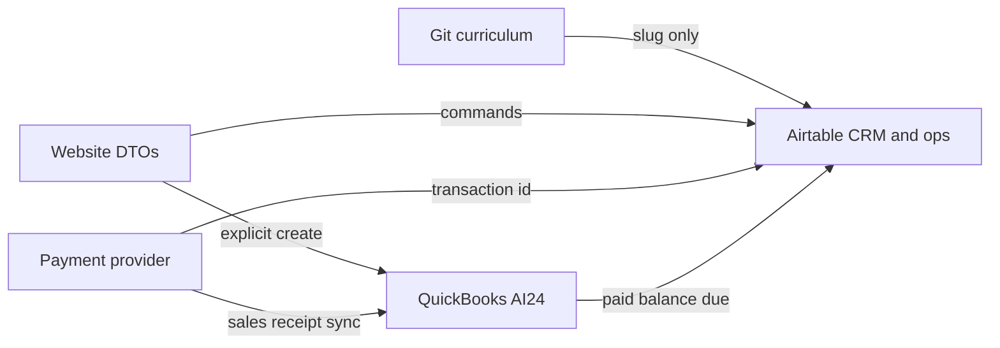

# DCC Fabrication OS

Phase 1 locks the operating model. It does not create Airtable fields, enable payments, or add UI.

Field-level schema: [`FABRICATION-OS-SCHEMA.md`](./FABRICATION-OS-SCHEMA.md). Domain code: [`lib/dcc/fabrication-os/`](../../lib/dcc/fabrication-os/).

[`OPERATING-PROGRESS.md`](./OPERATING-PROGRESS.md) remains the scoreboard. This document does not mark the queue, checkout, or QuickBooks as built.

## What this is

One relational operating graph, read through many views.

The graph connects CRM people, classes, competencies, machines, fabrication jobs, print runs, payments, and payouts. A queue board, a machine calendar, a person page, and a client project page are queries over those records. They are not separate datasets.

The compounding loop this model is for:

Person discovers DCC → attends a workshop → gains a skill → the skill is verified → they become eligible for production → they fabricate real work → the work is documented → documentation can become portfolio → public proof builds trust → more client work enters → more people train.

## Two products in this repo

Fabrication OS belongs to DCC ops, not the Infra24 tenant product.

| Layer | Where it lives | Use for Fabrication OS |
|---|---|---|
| DCC public site and ops | `app/(marketing)/`, `lib/dcc/` | Yes. Intake already writes Inquiry jobs. |
| Infra24 tenant SaaS | `app/o/[slug]/`, Supabase | No. `courses`, `workshop_sessions`, and `workshop_registrations` are a different product. |
| LIFE OS | Airtable `apprswzWnLrHBwFcx` | No. Engineering backlog only. |
| Oolite alumni | Airtable `appBvA0pWq9XkthTc` | No. |

There is no `/backoffice` or `/fabricators` route yet. Closest staff surfaces are `/scale-up`, `/dashboard/ceo`, and `/fabricate/internal/[slug]`, gated by shared passwords in `lib/dcc/scale-up-auth.ts` and `lib/dcc/fabrication/proposal-auth.ts`.

Clerk wraps the app. CRM People are matched by email on signup. A Person is not a user account. `Clerk User ID` is an optional link, set only from an authenticated session.

## Source of truth

| Concern | Authority |
|---|---|
| People, roles, sessions, enrollments, competencies, jobs, runs, machines, locations, portfolio candidates, payout operational state | Airtable base **INFRA24 CRM / DCC OS** `appWoYBRdklcz2RJH` |
| Syllabus and course copy | Git. Airtable Courses store slugs only. |
| Current pilot proposal pages (Heather, Carol) | Git, until a job stores `Git Proposal Slug` |
| Customer, estimate, invoice, sales receipt, billed amount, paid amount, balance, due date, accounting history | QuickBooks company **AI24, INC**, once a record exists |
| Card charge for a prepaid public workshop | Payment provider. The provider transaction id is stored on a Payment Reference. Accounting truth for that sale is a QuickBooks sales receipt, not a per-seat invoice. |
| Private / institutional tuition and fabrication billing | QuickBooks estimate, then invoice, after an explicit **Create in QuickBooks** action |
| Website | DTOs and commands. Pages do not own records. |

QuickBooks is not in the repo yet. `PaymentProviderAdapter` is an interface with no client. Stripe checkout routes stay disabled. [`OPERATING-PROGRESS.md`](./OPERATING-PROGRESS.md) still blocks live Stripe until a DCC SKU and merchant account exist.

### Money rules

- Airtable may cache payment state and external ids. A checked “Paid” field is not accounting truth.
- When a QuickBooks id exists, QuickBooks wins. A manual Paid write is rejected unless the adapter has confirmed balance zero.
- Accepting a quote does not create an invoice. **Create in QuickBooks** is a separate command: preview customer, lines, quantities, rates, materials, labor, project reference, and due date, then confirm, then store the returned ids.
- Rendering a page, reading Airtable, browsing jobs, or changing a production stage does not create a financial document.
- Public prepaid workshops use checkout plus a sales receipt. Private and institutional sessions use the invoice flow. One enrollment or job gets one accounting document, not both.
- DCC sells the work. Fabricators supply production capacity through DCC. Client payment and fabricator payout are different records.
- Default compensation is a flat task fee, then hourly labor, then a fixed project fee. Revenue share runs only when the payout model is explicitly Revenue Share.
- Client revenue, materials, consumables, machine allocation, fabrication labor, finishing, shipping, external vendors, and fabricator compensation stay on separate cost lines. Phase 1 does not invent those numbers.

### Identity rules

- Reuse People `tbltHiqscY80ybsGE`. Do not create a second people table.
- A Person may hold several roles and may never log in.
- Public fabricator pages read an approved Fabricator Profile. They do not render the CRM row.
- CRM notes, email, phone, exact home address, earnings, payouts, and internal evaluation stay off public DTOs.
- Public Profile Consent on People is CRM consent. Fabricator approval is a separate status on the profile.

### Production rules

- A Job is the client project. A Run is one machine pass. One job has many runs.
- Job operating stage answers where the project is. Run status answers where the object is.
- Completing a class does not grant a machine competency.
- Competency path: Learner → Assisted → Verified → Active Fabricator, plus Inactive and Needs Reverification.
- Assignment is manual. A claimable queue waits until competency, machine authorization, location, and schedule can gate it.
- Machine owner, machine site, and operator are different links.
- Person area, machine site, and class venue are different location kinds.

## Route targets

Phase 1 adds no routes. Later phases use this map because `/o/[slug]/admin` is the tenant product.

| Audience | Paths |
|---|---|
| Staff | `/backoffice`, `/backoffice/people/[id]`, `/backoffice/fabricators`, `/backoffice/classes`, `/backoffice/calendar`, `/backoffice/enrollments`, `/backoffice/jobs/[id]`, `/backoffice/queue`, `/backoffice/machines`, `/backoffice/payments`, `/backoffice/payouts` |
| Public | `/fabricators`, `/fabricators/[slug]` |
| Client | `/portal/projects/[jobCode]` |
| Fabricator | `/portal/fabricator` |

Keep `/fabricate/*` as the public studio and proposal site. A “Work with this fabricator” action posts into the existing intake with the fabricator slug. It does not publish a direct email, a rate, or a rating.

Queue board, machine view, calendar, fabricator view, and job view are queries over the same Run records.

Client-safe job phase, derived in `clientJobPhase()`, not stored:

Quote / Approval → Payment → Production Queue → Fabrication → Quality Review → Ready / Delivered

## Permissions

Encoded in `lib/dcc/fabrication-os/permissions.ts`. Phase 2 maps these onto Clerk. Server functions enforce them. Hiding a button is not authorization.

| Role | Can | Cannot |
|---|---|---|
| Public | Approved fabricator profiles, public portfolio, public class listings | CRM rows |
| Client | Own job DTO, own enrollments, own payment links | Other jobs, costs, payouts, internal notes |
| Fabricator | Own competencies, assigned runs, own payout states, own portfolio candidates | Other payouts, CRM notes, job margin, self-assignment of unassigned work |
| Instructor | Sessions they teach, attendance on those sessions | Finance |
| Estimator | Jobs through Quoted, quote lines, QuickBooks preview | Payout approval, QuickBooks create |
| Operations | Queue, assignment, run updates, machines, session ops, payout visibility | Mark payout Paid, create QuickBooks records |
| Admin | All of the above, payout approval, mark payout Paid, QuickBooks create, profile approval, competency verification | — |

Cookie gates on `/scale-up` and proposals stay until Phase 2 replaces staff access. Do not add a third auth stack.

## Repository boundary

Pages do not call Airtable. Domain types do not use Airtable field ids.

Interfaces in `lib/dcc/fabrication-os/repositories.ts`:

- `PeopleRepository`
- `CoursesRepository`
- `SessionsRepository`
- `EnrollmentsRepository`
- `CompetenciesRepository`
- `JobsRepository`
- `RunsRepository`
- `MachinesRepository`
- `PaymentsRepository`
- `PayoutsRepository`
- `PortfolioRepository`
- `PaymentProviderAdapter` — `previewInvoice`, `createInvoice`, `createSalesReceipt`, `pullBalances`

Phase 1 ships the interfaces and pure functions (state machines, legacy stage map, redaction). It does not ship Airtable or QuickBooks implementations.

`assertExplicitAccountingCommand()` throws unless the caller passes `explicit_action`. Adapters must call it before a write.

Existing `lib/dcc/fabrication/schema.ts` remains the git proposal-page model. Do not retarget Heather or Carol at Airtable until an operator links `Git Proposal Slug`.

## State machines

Pure functions in `lib/dcc/fabrication-os/states.ts`. Illegal jumps fail before any write.

| Machine | Forward path | Exceptions |
|---|---|---|
| Enrollment | Interested → Registered → Payment Pending → Confirmed → Attended → Completed | Cancelled from any pre-complete state. No Show from Confirmed or Attended. Refunded only when payment state is Paid. Completion does not grant a competency. |
| Competency level | Learner → Assisted → Verified → Active Fabricator | Verified and Active Fabricator require verifier id and date. |
| Competency status | Active at Active Fabricator → Inactive or Needs Reverification | Needs Reverification returns only to Verified or Active Fabricator. |
| Job | New Inquiry → Scoped → Quoted → Accepted → Payment Pending → Production Authorized → Open for Fabrication → Assigned / Claimed → In Production → Review / QC → Ready → Delivered → Documented → Closed | On Hold resumes to the held stage. Declined only before Production Authorized. Cancelled from a non-terminal stage. Production Authorized requires Paid, Waived, Not Required, or Partially Paid with an explicit override. |
| Run | Ready → Assigned → Queued → Printing → Cooling / Curing → Post Processing → QC → Complete | Paused resumes to the prior active state. Failed, Cancelled, and Reprint Required are terminal on that run. A reprint is a new Run linked with Reprint Of. |
| Payment | Pending → Invoiced → Partially Paid or Paid | Not Required is terminal. Failed returns to Pending. Paid can become Refunded. Invoiced through Refunded can enter Needs Reconciliation. Manual Paid is rejected when a QuickBooks id exists and the adapter has not confirmed balance zero. |
| Payout | Estimated → Awaiting Approval → Approved → Payable → Paid | Not Applicable is its own terminal. On Hold from any unpaid state, then resume. Revenue share math runs only for model Revenue Share. Default model is Flat Task. |

Git micro-stages `FILE_RECEIVED`, `TECHNICAL_REVIEW`, `MATERIAL_CONFIRMATION`, and `PROTOTYPE_SCOPING` collapse into Scoped, tracked as checkboxes. `ACCEPTED_PAID` becomes Accepted plus a Payment Reference. Legacy Airtable Stage `Paid` does not set Operating Stage.

## Non-goals

- A freelancer marketplace, star ratings, or public hourly rates
- A second People table, a second auth stack, or a second curriculum body in Airtable
- Per-seat QuickBooks invoices for prepaid public workshops
- Revenue share as the default fabricator payout
- Render-time or read-time accounting writes
- Automatic publication of client work
- Unrestricted self-assignment of runs
- Treating Supabase workshop registrations or the Programming table as the DCC class system
- Enabling Stripe or QuickBooks in this phase

## Phases after this one

1. **This phase.** Architecture, schema spec, domain types, permissions, tests.
2. **Back office.** Shell, queue, jobs, machines, sessions, calendar, person detail, payment state. Still no implicit accounting writes.
3. **Public fabricators.** `/fabricators` and portfolio, DCC-routed inquiry.
4. **Portals.** Client project pages, fabricator dashboard, payouts, assignment.
5. **Automation.** QuickBooks reconciliation, checkout reconciliation, notifications, claim gates, machine conflicts, portfolio suggestions.

## Risks

- Job Stage “Paid”, Airtable Transactions, and git `paymentStatus` already disagree. Payment Reference is the operational money row. Transactions stay a CEO-scorecard read model.
- Stage and payment updates need one server command plus a Change Log row. No browser writes to Airtable.
- A sales receipt and an invoice must not both exist for the same enrollment or job.
- Email upsert can attach the wrong Person. Clerk User ID is set only from a signed-in session.
- Public and client loaders return redacted DTOs. `fetchAllRecords` inside a page is a defect.
- Jobs.Machine today describes one print. The queue reads Runs.
- Bookings and Runs can both claim a machine. Phase 1 stores an optional Booking link and does not detect conflicts. Assignment stays manual.
- Courses store slugs only. Programming is not the DCC calendar.
- Adding Operating Stage leaves the live Stage select untouched so `createInquiryJob()` can keep writing Inquiry.

## Decisions still open

These block Airtable mutation, which is after this phase.

- Confirm live Jobs.**Customer** is a People link before adding any second client link. Checklist in the schema doc.
- Confirm which Stripe account is the merchant for AI24, INC before any checkout work.
- Leave legacy Transactions rows as historical scorecard data. Do not backfill them as reconciled QuickBooks records.
