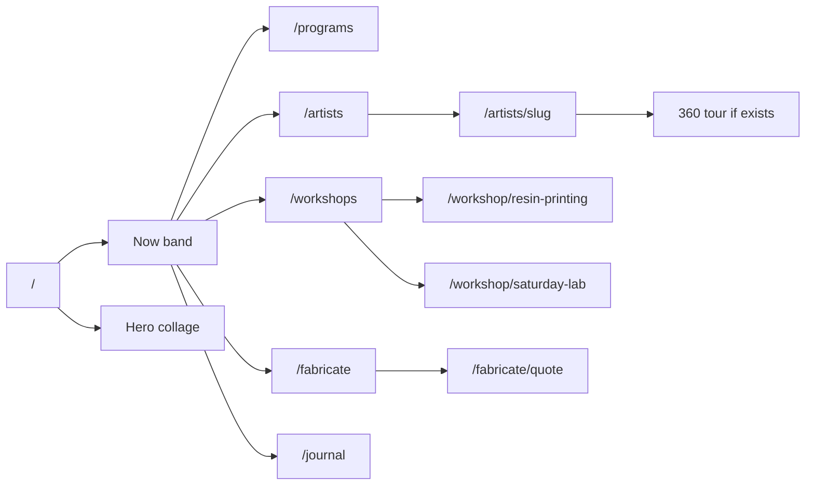

# DCC MIA — what we built and every image to make

Living org status: [`STATUS.md`](./STATUS.md). Culture packet: [`lib/dcc/culture/RECORD.md`](../../lib/dcc/culture/RECORD.md). Fabricate drop filenames: [`public/dcc/fabrication/ASSETS.md`](../../public/dcc/fabrication/ASSETS.md). Resin documentary IDs: [`docs/workshops/RESIN_PRINTING_MEDIA_SHOT_LIST.md`](../workshops/RESIN_PRINTING_MEDIA_SHOT_LIST.md).

Live on **main** / [dcc.miami](https://www.dcc.miami) after [PR #3](https://github.com/moisestech/infra24/pull/3). Fabricate Phase 2 (estimate planner, `/fabricate/projects`) is still on sibling `feature/dcc-fabricate-phase2` and is **not** on production.

**Hard rules for every frame:** no invented artist names; no prices, logos, or readable UI in fabricate/workshop stills; caption **conceptual** vs **documentary**; founders on `/artists` are **not** the Clandestine roster.

---

## What we built (product, not images)

### Culture (live)

- Records in `lib/dcc/culture/`: programs, artists, editorial, projects, relations.
- **Program 001:** Clandestine Art Fair 2026 — known-facts skeleton, **no** `heroImage`, **no** `artistIds`.
- **3 published artists** (founders, not the fair): Moises (featured on `/` `#now`), Fabiola, Angelo. Bios are Edge Zones one-liners only.
- Routes: `/artists`, `/artists/[slug]`, `/programs`, `/programs/art-fairs/clandestine-art-fair-2026`, `/journal` (conversations empty on purpose).
- Studio 360s: Moises + Fabiola in [`lib/dcc/studios/tours.ts`](../../lib/dcc/studios/tours.ts). **Angelo: no tour — do not invent.**
- Clerk: `/artists`, `/workshops`, `/fabricate`, `/fabrication` → `/fabricate`, `/programs`, `/journal` are public.

### Education (live)

- DCC sessions band on `/workshops` from [`lib/dcc/education/offerings.ts`](../../lib/dcc/education/offerings.ts): Saturday Lab, resin (8 people / 3 hr), Vibecoding & Net Art, IP in the Age of AI. **No prices.** No offering-card images yet.
- Resin engine already has **conceptual** Cloudinary banners + technique boards (not shop photos).

### Fabricate (partially live)

- On **main:** `/fabricate`, `/pricing`, `/finishes`, `/quote`. Section slots in [`lib/dcc/fabrication/section-media.ts`](../../lib/dcc/fabrication/section-media.ts) are **placeholders** except finishes hero falls back to resin instructional `113`.
- On **phase-2 branch:** conceptual stills `02/03/05/06` marked ready; finish ladder `300–305` on Cloudinary; **hero `01` still missing.**

---

## Image types (use these labels on disk and in alt)

| Type | What it is | Label in UI |
|---|---|---|
| **Portrait** | Face / upper body, approved | Artist name |
| **Work documentation** | Installation or object, credit + year | Title (year) |
| **Program hero** | Booth / hang / fair context | Program title |
| **Selected work** | One object, 4:5, caption fields | Title, year, medium, credit |
| **Studio 360 poster** | Still that sits under click-to-enter | “Click to enter” |
| **Documentary process** | Real shop/fair/class; people need releases | Honest location/gear |
| **Conceptual illustration** | Teaching/marketing still, not a shop photo | “Conceptual — not a documentary photo” |
| **Teaching still** | Real gear, no people, no readable UI | Venue/module |
| **Kit pack shot** | Tray of teaching objects | Kit name |
| **Failure specimen** | **Fully cured** fail, labeled | Symptom name |
| **Diagram** | Floor plan / workflow graphic | No photo needed |
| **Ultra-wide banner** | 21:9 module/section | HTML titles, no text in pixels |

**Drop folders**

- Culture: Cloudinary `dccmiami/artists/{slug}/`, `dccmiami/programs/{slug}/`, `dccmiami/journal/{slug}/` **or** `public/dcc/culture/...` (force-add; `public/` gitignored).
- Fabricate: `public/dcc/fabrication/{filename}` then `ready: true` in `section-media.ts`.
- Resin: keep existing `assetId`s in the resin shot list.

---

## A. Culture — make these (highest yield)

### A1. Clandestine program (blocked on three real names)

Do **not** shoot “Moises/Fabiola/Angelo at Clandestine.” Wait for the packet.

Once names exist, per artist:

| ID | Type | Aspect | Size | Primary | Alternate |
|---|---|---|---|---|---|
| `clandestine-{slug}-portrait` | Portrait | 4:5 | 1200×1500 | Neutral, even light, Bakehouse/studio, no booth signage yet | Crop of approved existing portrait if they refuse a new one |
| `clandestine-{slug}-hero` | Work documentation | 16:9 | 2400×1350 | One selected work, full object, raking light | Installation crop if the object is huge |
| `clandestine-{slug}-work-01` … `05` | Selected work | 4:5 | 1600×2000 | Object on seamless / plinth | Detail macro of the same work |
| `clandestine-program-hero` | Program hero | 21:9 | 1920×823 | Empty / install-in-progress booth **after** venue is known | Fair exterior or hang diagram (graphic) if booth photo is late |
| `clandestine-install-01` | Documentary | 16:9 | 2400×1350 | Hang / lighting, no unread contracts | Crowd shot **only with releases** |
| `clandestine-recap-01` | Documentary | 16:9 | 2400×1350 | After-fair documentation for the program recap | Conversation still of the same hang |

Program page today: **no image** — honest fallback. That is correct until the packet exists.

### A2. Founders already published — upgrades, not required to ship

| ID | Who | Have now | Make | Alternate |
|---|---|---|---|---|
| `angelo-hero` | Angelo | Portrait only, **no hero** | One exhibition work 16:9 | Second work 4:5 for related grid later |
| `angelo-360-poster` | Angelo | **No tour** | Only if a real Momento360/Kuula exists — poster still 16:9 | Do not fake a 360 |
| `moises-portrait-refresh` | Moises | Knight PFP | Optional studio portrait 4:5 matching Fabiola/Angelo lighting | Keep current |
| `fabiola-location-still` | Fabiola | Portrait + Surveillance Cutie hero | Optional studio context 16:9 (no invented address) | Keep current |
| `founder-practice-grid-*` | Each | Homepage already has extra Fabiola works | 3–5 captioned works **if they approve** | Reuse homepage Cloudinary set (already shot) |

Homepage collage **already has** real photography in [`lib/marketing/dcc-home-photography.ts`](../../lib/marketing/dcc-home-photography.ts). Do not reshoot unless you want a cultural-center H1. `/` `#now` is **text-only** — optional later: 4:5 thumbs for Clandestine / featured artist / journal (same files as program/artist/editorial heroes).

### A3. Journal / Conversations (empty on purpose)

When the first guest is real:

| ID | Type | Aspect | Size | Primary | Alternate |
|---|---|---|---|---|---|
| `journal-{slug}-hero` | Portrait or still | 16:9 | 2400×1350 | Guest + work in studio | Pull-frame from video |
| `journal-{slug}-still-01` | Documentary | 4:5 | 1600×2000 | Hands/work during talk | Audio-only: typographic card (diagram type) |

No podcast artwork this phase.

---

## B. Fabricate — make these (shop / still life)

Canonical filenames in [`public/dcc/fabrication/ASSETS.md`](../../public/dcc/fabrication/ASSETS.md). **Main still shows color placeholders** until `ready: true`.

| File | Type | Aspect | Size | Where | Primary | Alternate |
|---|---|---|---|---|---|---|
| `01-fabricate-hero.webp` | Documentary process | 21:9 | 1920×823 | `/fabricate` hero | **P0.** Bakehouse / Studio 43 desk: printer silhouette, cured or FDM samples, **no people, no UI** | Conceptual desk still (label it); or crop of `120-m7-max-equipment-portrait` until the real hero exists |
| `02-service-lanes.webp` | Conceptual or documentary | 16:9 | 1600×900 | Landing lanes | Triptych: USB/file, mesh on laptop silhouette, sketch-to-object. **No text in frame** | Three separate 1:1 tiles if a triptych is too tight (phase-2 already has a conceptual ready) |
| `03-pricing-transparency.webp` | Still life | 16:9 | 1600×900 | `/fabricate` + `/pricing` | Scale cube, spool silhouette, timer form, **blank** estimate card — **no numbers** | Instructional `112-project-planning-drivers` (already used as planning stand-in) |
| `04-finishes-states.webp` | Documentary sequence | 16:9 | 1600×900 | `/fabricate/finishes` | **Same object** raw → cleaned → assembly → primed → finished, L→R | Keep resin `113-post-processing-states` (current stand-in) |
| `05-artist-access.webp` | Still life | 16:9 | 1600×900 | Access | Badge / checklist / token, **no logos, no $** | Conceptual (phase-2 ready) |
| `06-quote-intake.webp` | Still life | 16:9 | 1600×900 | `/fabricate/quote` | Labeled USB, closed box, blank form silhouette, **no PII** | Conceptual (phase-2 ready) |
| `finish-l0-raw.webp` | Specimen | 4:5 | 1200×1500 | Finishes L0 | Supports just off, raking light | Cloudinary `301` conceptual (phase-2) |
| `finish-l1-clean.webp` | Specimen | 4:5 | 1200×1500 | L1 | Sanding evidence, no paint | `302` |
| `finish-l2-assembly.webp` | Specimen | 4:5 | 1200×1500 | L2 | Pins/seams, unpainted | `303` |
| `finish-l3-exhibition.webp` | Specimen | 4:5 | 1200×1500 | L3 | Primed/filled | `304` |
| `finish-l4-finished.webp` | Specimen | 4:5 | 1200×1500 | L4 | Painted/coated presentation | `305` |

**P0 = `01-fabricate-hero.webp`.** Everything else has a conceptual or instructional alternate already designed.

Day-of Open Studios (ops, not a program record): H2D hero **if the machine is installed**, finish samples, QR still → `/?source=open-studios`. Same constraints as fabricate hero.

---

## C. Education / resin — mostly shot as **conceptual**; replace with documentary when honest

### C1. Offerings band (no images yet — optional)

Four 16:9 or 4:5 cards on `/workshops#offerings`:

| ID | Session | Primary | Alternate |
|---|---|---|---|
| `offering-saturday-lab` | Saturday Lab | In-room website/vibe table, no accounts on screens | Existing Saturday Lab banner `01_start-here` |
| `offering-resin` | Resin | Cured samples + printer silhouette | Module banner `welcome` |
| `offering-vibe-coding` | Net art | Browser-as-medium still | Existing vibe banner set |
| `offering-ip-ai` | IP Age of AI | Typographic / diagram card | Existing landscape banner in `ip-age-of-ai-video.ts` |

### C2. Resin — already have conceptual Cloudinary (keep until documentary exists)

**Ultra-wide banners (21:9, ~1915×821)** — HTML titles, never bake text: welcome, why-resin, safety-zones, complete-workflow, file-readiness, slicer-lab, print-wash-cure, failure-clinic, project-readiness.

**Technique boards 200–214** (16:9 conceptual teaching boards). Alternate: documentary stills from the resin shot list A–B with the **same IDs**.

**Instructional concepts 107–135** (slicer compare, PPE atlas, failure specimens, tool cards). Alternate: real slicer screenshots **without** private data for 119; real cured fails for 129–131.

### C3. Resin documentary shot list

Shoot **once**, natural light, DigiLab/Oolite gear. Prefer no people except class shots (releases). Full IDs live in the resin shot list.

**Hub (16:10 / 16:9)**  
`resin-hero-01`, `resin-room-wide-01`, `resin-oolite-brand-01`, `resin-bakehouse-brand-01` (Bakehouse: keep placeholder if the room isn’t ready).

**Per-module stills**  
welcome TVs+QR; why-resin macro pair; safety zones + PPE portrait; five-stage workflow; file good/bad; slicer UI + five step screenshots; stations wide + plate/vat; failure grid + five isolated specimens; readiness kit.

**Kit pack shots 4:5**  
`resin-kit-00` … `resin-kit-08` (one tray per module).

**Class (releases)**  
wide class, pair on slicer, facilitator demo, hands on **cured** print, outcome card with PII scrubbed.

**Video loops (optional)**  
5–12s: model, slice, print, wash, cure; 15–30s zone walk; 60–90s reel after a real class.

**Diagrams (design, not photo)**  
`resin-diagram-zones-01`, `resin-diagram-workflow-01`, `resin-tv-break-01`, `resin-tv-join-01` (QR stays live-generated).

---

## D. Other workshops (already imaged — optional refresh)

Saturday Lab banners `01–07` and IP Age of AI landscape banner already on Cloudinary. Only reshoot if you want them to match resin’s “no baked titles” rule.

---

## Make order (so you are not shooting 80 frames on day one)

1. **`01-fabricate-hero.webp`** — unlocks the fabricate landing as a real shop, not a placeholder.
2. **Finish ladder L0–L4 on one object** (`finish-l0` … `l4` + optional `04-finishes-states` strip) — same prop, five states.
3. **Clandestine** — wait for names; then portrait + 1 hero + 3 works **per artist** + one program hero.
4. **`angelo-hero`** — fills the only founder page with a missing work image.
5. **Resin documentary hero + safety + failure specimens** — replace conceptual only where you have real cured parts.
6. **Journal stills** — only after a real conversation.
7. Everything else is alternate/optional.

---

## What not to make

- Fake Clandestine portraits or booth photos.
- Angelo 360.
- Instagram templates / podcast cover as a product.
- Fabricate stills with dollar amounts or live slicer UI.
- Workshop curriculum images that encode fabricate rate cards.

---

## How to update this file

1. When a slot ships, mark it in the matching table (or move it to “have now”).
2. Keep Clandestine rows unnamed until the culture packet has real slugs.
3. Do not copy fabricate prices into resin IDs.
4. Commit with the namespace of the images you added (`culture` / `fabricate` / `education` / `studios`).
